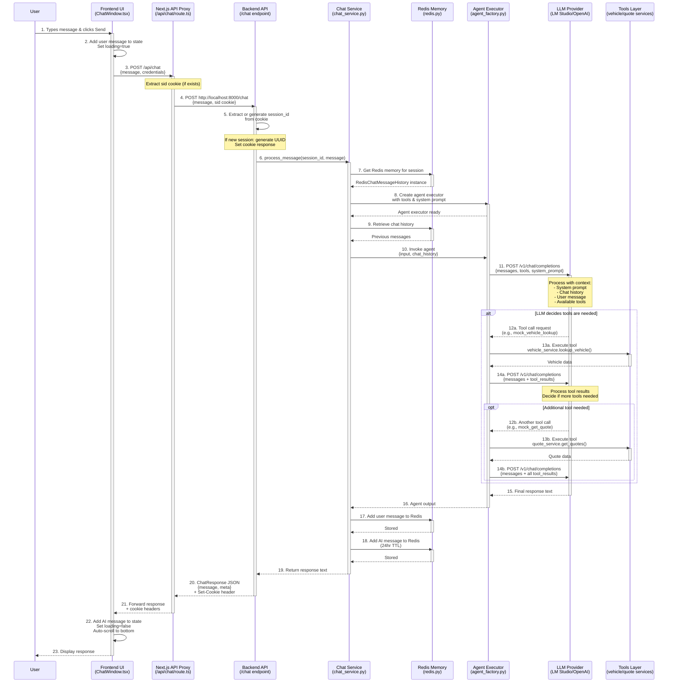

# Insurance Bot - Complete Request Flow Diagram

## Visual Flow Diagram



---

## Detailed Step-by-Step Breakdown

### Phase 1: User Interaction → Frontend (Steps 1-3)

**Step 1: User Input**
- **Location**: Browser
- **File**: `frontend/components/ChatWindow.tsx`
- **Action**: User types message and presses Enter or clicks Send button
- **State Change**: None yet

**Step 2: Frontend State Update**
- **Location**: React Component
- **File**: `frontend/components/ChatWindow.tsx:42-50`
- **Actions**:
  - Add user message to `messages` state array
  - Set `isLoading` to `true` (shows typing indicator)
  - Trigger auto-scroll to bottom
- **State**: `messages = [...messages, {role: 'user', content: text}]`

**Step 3: API Call to Proxy**
- **Location**: Browser → Next.js Server
- **File**: `frontend/components/ChatWindow.tsx:52-59`
- **HTTP Request**:
  ```
  POST http://localhost:3000/api/chat
  Content-Type: application/json
  Credentials: include (forwards cookies)

  Body: {"message": "I need insurance for my 2020 Toyota Camry"}
  ```
- **Cookie**: If exists, includes `sid=<session-uuid>` cookie

---

### Phase 2: Frontend Proxy → Backend API (Steps 4-5)

**Step 4: Next.js API Route Proxy**
- **Location**: Next.js Server
- **File**: `frontend/app/api/chat/route.ts:10-40`
- **Actions**:
  1. Extract request body: `const { message } = await request.json()`
  2. Get session cookie: `request.cookies.get('sid')`
  3. Forward to backend API
- **HTTP Request**:
  ```
  POST http://localhost:8000/chat
  Content-Type: application/json
  Cookie: sid=<uuid> (if exists)

  Body: {"message": "I need insurance for my 2020 Toyota Camry"}
  ```

**Step 5: Backend Session Management**
- **Location**: FastAPI Server
- **File**: `backend/api/chat.py:16-24`
- **Actions**:
  1. Check for `sid` cookie in request
  2. If exists: use as `session_id`
  3. If not exists: generate new UUID as `session_id`
  4. Prepare response with Set-Cookie header
- **Cookie Response** (if new session):
  ```
  Set-Cookie: sid=<uuid>; HttpOnly; SameSite=lax; Max-Age=86400; Path=/
  ```

---

### Phase 3: Backend Processing (Steps 6-10)

**Step 6: Chat Service Invocation**
- **Location**: FastAPI Handler
- **File**: `backend/api/chat.py:26-30`
- **Action**: Call `ChatService().process_message(session_id, user_message)`
- **Purpose**: Orchestrate the conversation processing

**Step 7: Memory Initialization**
- **Location**: Chat Service
- **File**: `backend/services/chat_service.py:12-13`
- **Action**: `memory = get_memory(session_id)`
- **Redis Key**: `session:<session_id>`
- **Purpose**: Get or create Redis-backed conversation history

**Step 8: Agent Creation**
- **Location**: Chat Service
- **File**: `backend/services/chat_service.py:14`
- **Action**: `agent_executor = create_agent_executor()`
- **File**: `backend/agent/agent_factory.py:10-40`
- **Components Created**:
  1. LLM instance (via `get_llm()`)
  2. Tools list: `[mock_vehicle_lookup, mock_get_quote]`
  3. System prompt with instructions
  4. LangChain AgentExecutor with memory

**Step 9: Retrieve Chat History**
- **Location**: Chat Service
- **File**: `backend/services/chat_service.py:17`
- **Action**: `history = memory.messages`
- **Redis Operation**: `GET session:<session_id>`
- **Returns**: List of previous `HumanMessage` and `AIMessage` objects
- **Format**:
  ```python
  [
    HumanMessage(content="Hello"),
    AIMessage(content="Hi! How can I help with insurance?"),
    HumanMessage(content="I need a quote"),
    ...
  ]
  ```

**Step 10: Agent Invocation**
- **Location**: Chat Service
- **File**: `backend/services/chat_service.py:18-22`
- **Action**: `response = agent_executor.invoke({...})`
- **Input**:
  ```python
  {
    "input": "I need insurance for my 2020 Toyota Camry",
    "chat_history": [previous messages...]
  }
  ```

---

### Phase 4: LLM Processing & Tool Execution (Steps 11-15)

**Step 11: Initial LLM Call**
- **Location**: LangChain → LLM Provider
- **File**: `backend/agent/llm.py:25-30` (LM Studio config)
- **HTTP Request**:
  ```
  POST http://localhost:1234/v1/chat/completions
  Content-Type: application/json

  Body: {
    "model": "local-model",
    "messages": [
      {"role": "system", "content": "<system_prompt>"},
      {"role": "user", "content": "Hello"},
      {"role": "assistant", "content": "Hi!"},
      {"role": "user", "content": "I need insurance for my 2020 Toyota Camry"}
    ],
    "temperature": 0.7,
    "tools": [
      {
        "type": "function",
        "function": {
          "name": "mock_vehicle_lookup",
          "description": "Look up vehicle information...",
          "parameters": {...}
        }
      },
      {
        "type": "function",
        "function": {
          "name": "mock_get_quote",
          "description": "Get insurance quotes...",
          "parameters": {...}
        }
      }
    ]
  }
  ```

**Step 12a: LLM Requests Tool Call**
- **Location**: LLM Response
- **LLM Decision**: User wants quote → need vehicle info first
- **Response**:
  ```json
  {
    "choices": [{
      "message": {
        "role": "assistant",
        "tool_calls": [{
          "id": "call_abc123",
          "type": "function",
          "function": {
            "name": "mock_vehicle_lookup",
            "arguments": "{\"make\": \"Toyota\", \"model\": \"Camry\", \"year\": 2020}"
          }
        }]
      }
    }]
  }
  ```

**Step 13a: Tool Execution - Vehicle Lookup**
- **Location**: LangChain Agent
- **File**: `backend/agent/tools.py:8-20`
- **Action**: LangChain calls `mock_vehicle_lookup(**args)`
- **Delegation**: `backend/services/vehicle_service.py:7-30`
- **Mock Logic**:
  ```python
  # Generates deterministic mock data
  return {
    "vin": "1HGBH41JXMN109186",
    "make": "Toyota",
    "model": "Camry",
    "year": 2020
  }
  ```
- **Tool Result**: Vehicle dict returned to agent

**Step 14a: LLM Call with Tool Results**
- **Location**: LangChain → LLM
- **HTTP Request**:
  ```
  POST http://localhost:1234/v1/chat/completions

  Body: {
    "messages": [
      ...previous messages...,
      {"role": "assistant", "tool_calls": [...]},
      {"role": "tool", "tool_call_id": "call_abc123", "content": "{vehicle data}"}
    ],
    "tools": [...]
  }
  ```

**Step 12b: LLM Requests Second Tool**
- **LLM Decision**: Now have vehicle info → can get quote
- **Response**:
  ```json
  {
    "tool_calls": [{
      "function": {
        "name": "mock_get_quote",
        "arguments": "{\"vehicle_make\": \"Toyota\", \"vehicle_model\": \"Camry\", \"vehicle_year\": 2020, \"coverage_type\": \"full\"}"
      }
    }]
  }
  ```

**Step 13b: Tool Execution - Get Quote**
- **Location**: LangChain Agent
- **File**: `backend/agent/tools.py:23-35`
- **Action**: Call `mock_get_quote(**args)`
- **Delegation**: `backend/services/quote_service.py:7-50`
- **Mock Logic**:
  ```python
  # Generates 3 mock quotes
  return [
    {
      "provider": "SafeGuard Insurance",
      "premium_monthly": 180.0,
      "coverage": "full",
      "details": {
        "deductible": "$500",
        "policy_limit": "$100,000",
        "special_features": ["Roadside assistance", "Rental car coverage"]
      }
    },
    # ... 2 more quotes
  ]
  ```

**Step 14b: LLM Call with All Results**
- **HTTP Request**: Similar to 14a but includes both tool results

**Step 15: Final LLM Response**
- **LLM Decision**: Have all info → generate natural language response
- **Response**:
  ```json
  {
    "choices": [{
      "message": {
        "role": "assistant",
        "content": "I found some great insurance quotes for your 2020 Toyota Camry! Here are your options:\n\n1. SafeGuard Insurance - $180/month..."
      }
    }]
  }
  ```

---

### Phase 5: Memory Persistence (Steps 17-18)

**Step 17: Store User Message**
- **Location**: Chat Service
- **File**: `backend/services/chat_service.py:24`
- **Action**: `memory.add_user_message(user_message)`
- **File**: `backend/memory/redis.py` (LangChain's RedisChatMessageHistory)
- **Redis Operation**:
  ```
  APPEND session:<session_id> <serialized HumanMessage>
  EXPIRE session:<session_id> 86400
  ```

**Step 18: Store AI Response**
- **Location**: Chat Service
- **File**: `backend/services/chat_service.py:25`
- **Action**: `memory.add_ai_message(response)`
- **Redis Operation**:
  ```
  APPEND session:<session_id> <serialized AIMessage>
  EXPIRE session:<session_id> 86400
  ```
- **TTL**: 24 hours (86,400 seconds)

---

### Phase 6: Response Flow (Steps 19-23)

**Step 19: Chat Service Returns**
- **Location**: Chat Service → API Handler
- **File**: `backend/services/chat_service.py:27`
- **Return**: String response from LLM

**Step 20: API Response**
- **Location**: FastAPI Handler
- **File**: `backend/api/chat.py:31-38`
- **HTTP Response**:
  ```
  HTTP/1.1 200 OK
  Content-Type: application/json
  Set-Cookie: sid=<uuid>; HttpOnly; SameSite=lax; Max-Age=86400

  {
    "message": "I found some great insurance quotes...",
    "meta": {"session_id": "<uuid>"}
  }
  ```

**Step 21: Proxy Forwards Response**
- **Location**: Next.js API Route
- **File**: `frontend/app/api/chat/route.ts:35-40`
- **Action**: Forward response + cookies to browser

**Step 22: Frontend State Update**
- **Location**: React Component
- **File**: `frontend/components/ChatWindow.tsx:60-70`
- **Actions**:
  1. Parse response: `const data = await response.json()`
  2. Add AI message: `setMessages([...messages, {role: 'assistant', content: data.message}])`
  3. Set loading: `setIsLoading(false)`
  4. Auto-scroll: `scrollToBottom()`

**Step 23: Display to User**
- **Location**: Browser
- **Component**: `MessageList.tsx`
- **Render**: AI message with formatted quotes displayed

---

## Debugging Checkpoints

### Checkpoint 1: Frontend to Proxy
- **Debug**: Browser DevTools → Network tab
- **Verify**: POST to `/api/chat` with message payload
- **Check**: Request headers include cookies

### Checkpoint 2: Proxy to Backend
- **Debug**: Backend logs or network inspector
- **Verify**: POST to `localhost:8000/chat`
- **Check**: Cookie forwarded correctly

### Checkpoint 3: Session Management
- **Debug**: Backend logs
- **File**: `backend/api/chat.py:16-24`
- **Verify**: `session_id` extracted or generated
- **Check**: Cookie set in response

### Checkpoint 4: Redis Connection
- **Debug**: Redis CLI: `redis-cli MONITOR`
- **Verify**: `GET session:<uuid>` and `SET session:<uuid>`
- **Check**: Messages stored with 24hr TTL

### Checkpoint 5: LLM API Call
- **Debug**: Backend logs with LangChain verbose mode
- **File**: `backend/agent/agent_factory.py:30` (set verbose=True)
- **Verify**: HTTP POST to LLM endpoint
- **Check**: Request includes tools and chat history

### Checkpoint 6: Tool Execution
- **Debug**: Add print statements in tools
- **File**: `backend/agent/tools.py:15 and :30`
- **Verify**: Tool functions called with correct args
- **Check**: Return values match expected schema

### Checkpoint 7: Memory Persistence
- **Debug**: Redis CLI: `GET session:<uuid>`
- **Verify**: Chat history stored after interaction
- **Check**: Both user and AI messages present

### Checkpoint 8: Response Flow
- **Debug**: Browser DevTools → Network tab
- **Verify**: Response received with message
- **Check**: Set-Cookie header present

---

## Component URLs & Ports

| Component | URL | Port |
|-----------|-----|------|
| Frontend UI | http://localhost:3000 | 3000 |
| Frontend API Proxy | http://localhost:3000/api/chat | 3000 |
| Backend API | http://localhost:8000 | 8000 |
| Backend Health | http://localhost:8000/health | 8000 |
| Redis | redis://localhost:6379 | 6379 |
| LM Studio | http://localhost:1234/v1 | 1234 |

---

## Data Flow Summary

```
User Input (Text)
    ↓
Frontend State (React State)
    ↓
HTTP Request (JSON)
    ↓
Next.js Proxy (Cookie Handling)
    ↓
FastAPI Backend (Session Management)
    ↓
Chat Service (Orchestration)
    ↓
Redis Memory (Chat History Retrieval)
    ↓
Agent Executor (LangChain)
    ↓
LLM API (Tool Decision)
    ↓
Tools (Vehicle/Quote Services)
    ↓
LLM API (Final Response Generation)
    ↓
Redis Memory (History Update)
    ↓
HTTP Response (JSON)
    ↓
Frontend State Update
    ↓
UI Render (Message Display)
```

---

## Key Files for Debugging

### Request Entry Points
1. `frontend/components/ChatWindow.tsx:42` - User message submission
2. `frontend/app/api/chat/route.ts:10` - Proxy handler
3. `backend/api/chat.py:14` - Backend endpoint

### Core Business Logic
4. `backend/services/chat_service.py:10` - Message processing
5. `backend/agent/agent_factory.py:10` - Agent creation
6. `backend/agent/llm.py:15` - LLM provider setup

### Tool Implementation
7. `backend/agent/tools.py:8` - Vehicle lookup tool
8. `backend/agent/tools.py:23` - Quote tool
9. `backend/services/vehicle_service.py:7` - Vehicle service
10. `backend/services/quote_service.py:7` - Quote service

### Memory & State
11. `backend/memory/redis.py:5` - Redis memory factory
12. `backend/api/chat.py:16` - Session cookie management

---

## Logging for Debugging

### Enable Verbose Logging

**Backend (LangChain)**:
```python
# In backend/agent/agent_factory.py:30
agent_executor = create_react_agent(
    llm=llm,
    tools=tools,
    prompt=prompt,
    verbose=True  # Enable to see agent reasoning
)
```

**Backend (FastAPI)**:
```python
# In backend/api/chat.py
import logging
logger = logging.getLogger(__name__)
logger.info(f"Received message: {chat_request.message}")
logger.info(f"Session ID: {session_id}")
```

**Frontend**:
```typescript
// In frontend/components/ChatWindow.tsx:52
console.log('Sending message:', text)
console.log('Current messages:', messages)
```

### Redis Debugging
```bash
# Monitor all Redis operations
redis-cli MONITOR

# List all sessions
redis-cli KEYS "session:*"

# View specific session
redis-cli GET "session:<uuid>"

# Check TTL
redis-cli TTL "session:<uuid>"
```

### LLM Request Debugging
```bash
# If using LM Studio, check server logs
# Or use network inspection tools

# For OpenAI, enable debugging:
# export OPENAI_LOG=debug
```

---

## Common Issues & Solutions

### Issue 1: Cookie Not Persisting
- **Debug**: Check browser DevTools → Application → Cookies
- **Solution**: Verify CORS_ORIGINS includes frontend URL
- **File**: `backend/config.py` and `backend/main.py:10`

### Issue 2: Session History Not Loading
- **Debug**: Redis CLI → `GET session:<uuid>`
- **Solution**: Check Redis connection and TTL
- **File**: `backend/memory/redis.py:7`

### Issue 3: LLM Not Calling Tools
- **Debug**: Enable verbose mode in agent
- **Solution**: Verify tools are registered and LLM supports function calling
- **File**: `backend/agent/agent_factory.py:25-28`

### Issue 4: Empty Response
- **Debug**: Check LLM API logs
- **Solution**: Verify LLM endpoint is running and accessible
- **File**: `backend/agent/llm.py` - check base URL

---

## Performance Metrics

**Typical Response Times**:
- Frontend → Proxy: ~10ms
- Proxy → Backend: ~20ms
- Backend → Redis (read): ~5ms
- Backend → LLM (first call): ~500-2000ms (depends on model)
- Backend → LLM (with tools): ~1000-4000ms (multiple calls)
- Redis write: ~5ms
- Total: **~1.5-5 seconds** (mostly LLM processing)

**Optimization Opportunities**:
1. Implement SSE streaming for progressive responses
2. Cache frequent vehicle lookups
3. Add request queuing for rate limiting
4. Use faster/smaller LLM for simple queries
